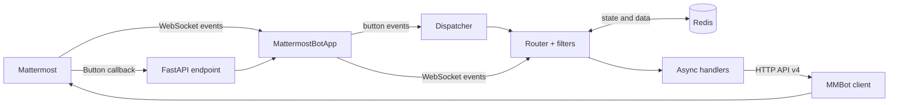

<div align="center">

# aiomost-tools

### Async-фреймворк для Mattermost-ботов на Python

От события в WebSocket до ответа бота — с роутингом, интерактивными кнопками,
состояниями пользователей и готовой интеграцией с FastAPI.

[](https://www.python.org/)
[](https://developers.mattermost.com/integrate/reference/server/server-reference/)
[](https://fastapi.tiangolo.com/)
[](./pyproject.toml)

[Документация](https://iliapr.github.io/aiomost/ru/) ·
[English docs](https://iliapr.github.io/aiomost/) ·
[Пример приложения](./examples/fastapi_mattermost_bot.py)

</div>

## О проекте

Mattermost предоставляет HTTP API и поток событий, но полноценный бот всё равно
требует много инфраструктурного кода: авторизации WebSocket, разбора событий,
маршрутизации, callback-обработчиков и хранения контекста диалога.

`aiomost-tools` объединяет эти задачи в один асинхронный слой. Разработчик
описывает поведение бота через декораторы, а библиотека управляет подключением,
диспетчеризацией и жизненным циклом приложения.

> **Формат:** персональный open-source проект · **Роль:** проектирование API,
> backend-разработка, тесты и документация · **Версия:** `0.1.0`

## Что реализовано

| Возможность | Реализация |
| --- | --- |
| Асинхронный API-клиент | Отправка сообщений, файлов, ответов в тредах и direct messages через `httpx` |
| Event-driven обработка | WebSocket listener с повторным подключением  |
| Декларативный роутинг | Декораторы событий, композиция роутеров и асинхронные фильтры |
| Интерактивные сценарии | Кнопки Mattermost и callback endpoint в FastAPI |
| Диалоги с контекстом | FSM-подобные состояния и данные пользователей в Redis |
| Интеграция с backend | Готовое ASGI-приложение и подключаемый `APIRouter` |
| Удобный public API | Высокоуровневый фасад `MattermostBotApp` и конфигурация из environment variables |

## Архитектура



`MattermostBotApp` служит фасадом над независимыми компонентами. HTTP-клиент,
роутеры и диспетчер можно использовать отдельно или подключить готовый FastAPI
lifecycle, который поднимает WebSocket listener и корректно завершает фоновую
задачу.

## Быстрый старт

Установите библиотеку с интеграциями для рабочего приложения:

```bash
pip install "aiomost-tools[fastapi,websocket] @ git+https://github.com/IliaPr/aiomost.git"
```

Создайте `bot.py`:

```python
from aiomost import MattermostBotApp


bot_app = MattermostBotApp.from_env()


@bot_app.message()
async def handle_message(event, bot, app):
    post = event.data.post

    if post.message == "!ping":
        await bot.reply_message(
            channel_id=post.channel_id,
            message_id=post.id,
            text="pong",
            actions=app.actions([("ping_ok", "OK", "ping_ok")]),
        )


@bot_app.button("ping_ok")
async def handle_button(event):
    return {"update": {"message": "Button received"}}


app = bot_app.create_fastapi_app()
```

Задайте конфигурацию и запустите ASGI-приложение:

```bash
export MATTERMOST_URL="https://mattermost.example.com"
export MATTERMOST_BOT_TOKEN="your-token"
export PUBLIC_BASE_URL="https://bot.example.com"

uvicorn bot:app --host 0.0.0.0 --port 8000
```

Приложение начнёт получать события через WebSocket и создаст два endpoint-а:

- `GET /health` — проверка доступности;
- `POST /mattermost/action` — callback интерактивных кнопок.

## Ключевые инженерные решения

- **Разделение ответственности.** API-клиент, роутинг, диспетчеризация, модели
  событий и state storage находятся в отдельных модулях.
- **Необязательные интеграции.** Базовый клиент зависит только от `httpx`;
  FastAPI, WebSocket и Redis подключаются через extras.
- **Гибкие обработчики.** В handler передаются только те зависимости, которые
  объявлены в его сигнатуре: `event`, `bot`, `app` или `state`.
- **Предсказуемые диалоги.** Обработчик активного состояния имеет приоритет, а
  смена состояния останавливает дальнейшую обработку текущего события.
- **Устойчивое соединение.** WebSocket listener автоматически переподключается
  с задержкой от 1 до 60 секунд.

## Конфигурация

| Переменная | Обязательна | Назначение |
| --- | --- | --- |
| `MATTERMOST_URL` | Да | Базовый URL сервера Mattermost |
| `MATTERMOST_BOT_TOKEN` | Да | Токен бота |
| `MATTERMOST_WS_URL` | Нет | Собственный WebSocket URL; по умолчанию вычисляется автоматически |
| `MATTERMOST_VERIFY_SSL` | Нет | Проверка TLS-сертификата WebSocket; по умолчанию `true` |
| `PUBLIC_BASE_URL` | Для кнопок | Публичный URL callback-сервиса |
| `REDIS_URL` | Для состояний | Подключение к Redis |

Доступные наборы зависимостей: `fastapi`, `websocket`, `redis` и `all`.
Подробные сценарии установки и настройки собраны в
[документации](https://iliapr.github.io/aiomost/ru/).

## Разработка и проверка

```bash
git clone https://github.com/IliaPr/aiomost.git
cd aiomost
poetry install --all-extras
poetry run python -m unittest discover -s tests
```

Тесты фиксируют контракт публичного API, нормализацию URL, диспетчеризацию
обработчиков и маршрутизацию button callback до зарегистрированного handler.
Документация собрана на MkDocs Material и доступна на русском и английском
языках.

## Стек

`Python 3.10+` · `asyncio` · `httpx` · `FastAPI` · `WebSockets` · `Redis` ·
`Poetry` · `MkDocs Material` · `unittest`

## Автор

**IliaPr** — Python-разработчик и автор проекта.

[GitHub](https://github.com/IliaPr) ·
[Email](mailto:ilya.prianichnikov@gmail.com)
